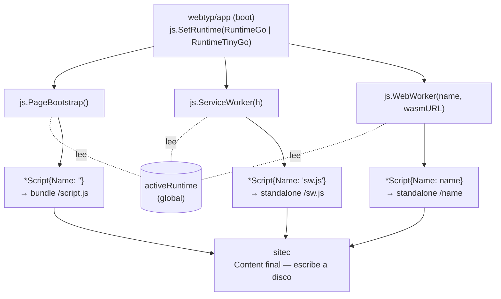
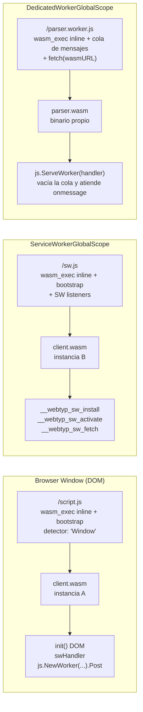
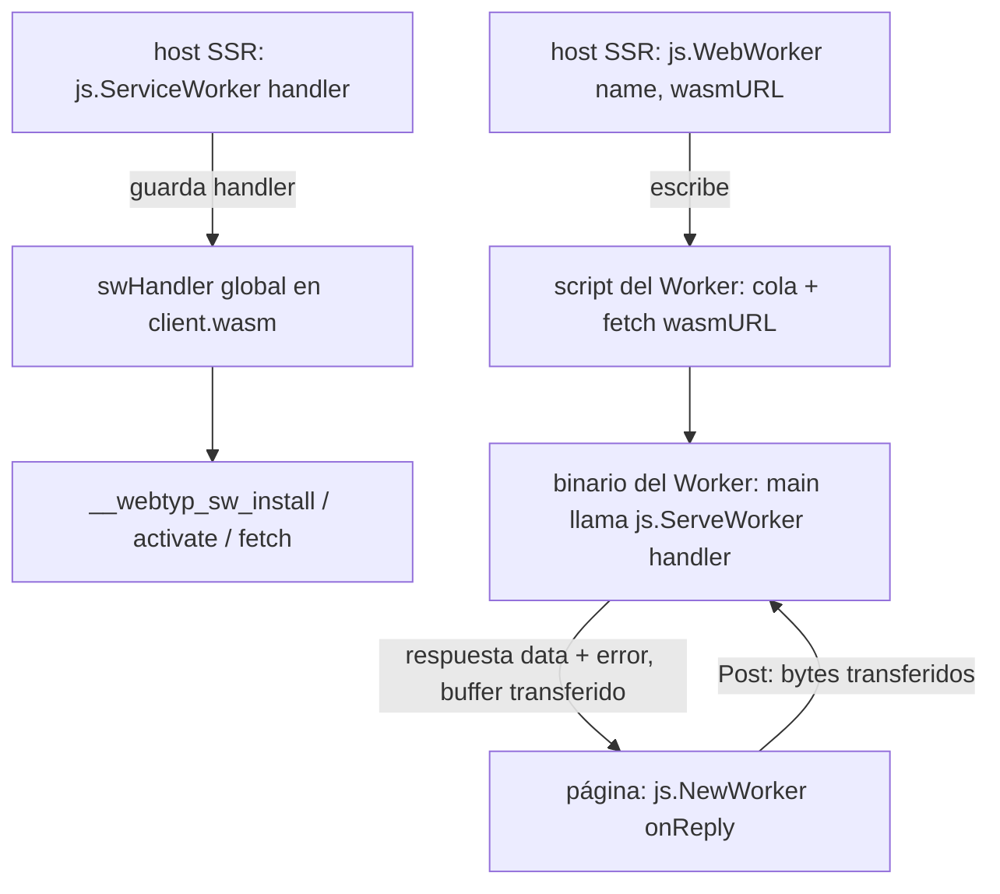

# Architecture — webtyp/js

## Flujo general

## Contextos de ejecución WASM

La página y el Service Worker cargan `client.wasm`; cada **Web Worker carga su propio binario** (`wasmURL`), para que el trabajo pesado (p. ej. inferencia de modelos) se compile para velocidad sin engordar la página. Cada contexto es un scope JS aislado — no pueden compartir la instancia WASM entre sí.

El shim detecta el contexto vía `self.constructor.name` para evitar ejecutar código DOM en SW/Worker.

## Separación de responsabilidades

| Paquete | Responsabilidad |
|---|---|
| `webtyp/js` | Composición JS (shims, embeds, constructores tipados). **Única fuente de wasm_exec.js** |
| `webtyp/app` | Orquestación: llama `js.SetRuntime`, registra `js.PageBootstrap()` con `sitec` |
| `webtyp/sitec` | Compilación WASM (Go/TinyGo) vía `WasmBuilder`, y bundling: recibe `[]*js.Script` con `Content` final y escribe a disco. **Sin JS propio** |

## Registro de handlers (lado WASM)

El handler de un Web Worker se registra **dentro de su propio binario** (`js.ServeWorker`), no en
el proceso SSR: ese proceso solo genera el script. Los mensajes son `[]byte`
(`js.Message.Data`); al cruzar a JS se copian una vez a un `Uint8Array` y su buffer se
**transfiere** (`postMessage(data, [buffer])`), sin segunda copia.

## Decisiones clave

- **`activeRuntime` es estado global write-once**: `app` lo escribe una vez al boot antes de que los módulos llamen `RenderJS()`. El extractor SSR de sitec corre en el mismo proceso → ve el global. Sin parámetros para el usuario.
- **`Content` es string final**: `sitec` lo escribe tal cual. Sin interfaces extra, sin resolución diferida. Idéntico al modelo de `webtyp/css`.
- **Sin `wasm_exec.js` en disco**: el archivo se inlinea en cada shim. No hay ruta `/wasm_exec.js` pública.
- **`client/assets/` eliminado**: `js/assets/` es la única fuente de verdad. Un solo lugar a actualizar cuando Go o TinyGo publican nuevas versiones del runtime.
